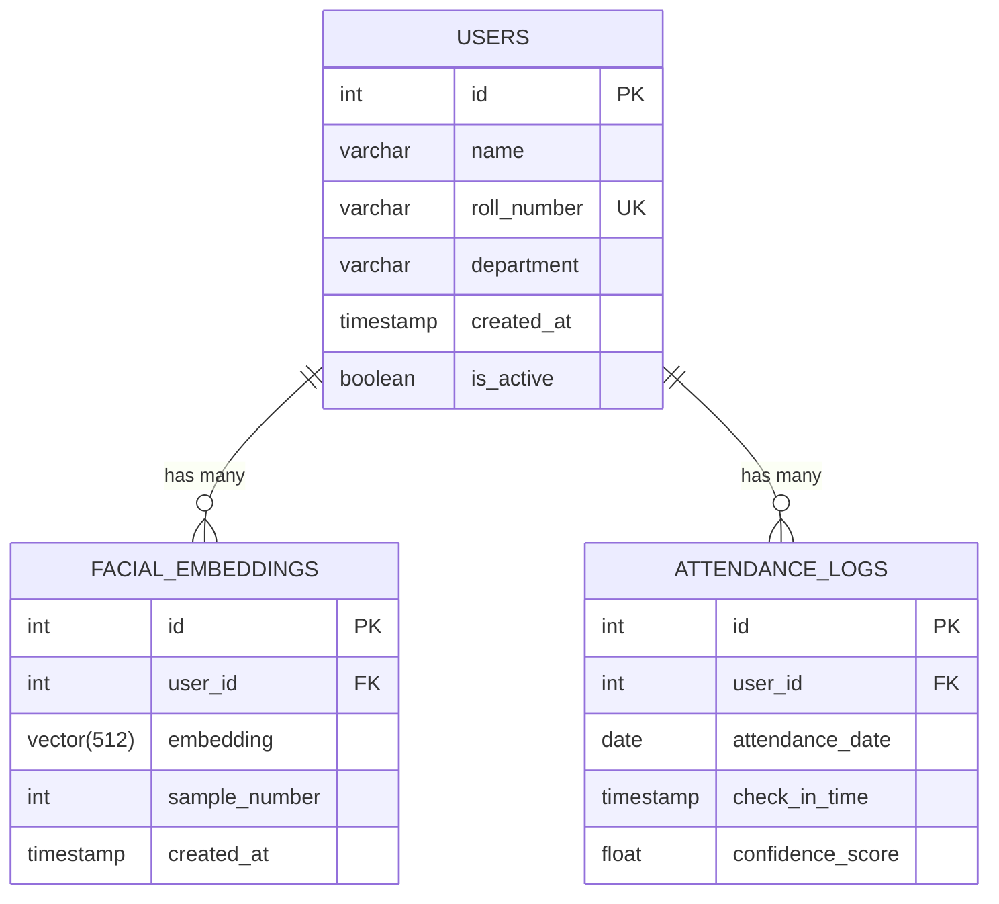

# 🧠 Smart Attendance System — Implementation Plan

## Summary

| Item | Decision |
|---|---|
| **Purpose** | College prototype, ~10 users |
| **Backend** | Python 3.10+ / FastAPI |
| **Database** | PostgreSQL (Metadata) + FAISS (Vectors) |
| **Face Recognition** | InsightFace (`buffalo_sc` — lightweight model) |
| **Camera** | Laptop webcam via OpenCV |
| **Deployment** | Local only |
| **Hardware** | 4GB RAM, Intel i3-5005U (CPU-only inference) |

> [!IMPORTANT]
> With 4GB RAM and no dedicated GPU, we use the **`buffalo_sc`** model (smallest InsightFace model, ~30MB) instead of `buffalo_l` (~330MB). This keeps memory usage under ~500MB total for the app.

---

## Project Structure

```
smart-attendance/
├── app/
│   ├── __init__.py
│   ├── main.py                # FastAPI entry point
│   ├── config.py              # Settings & environment config
│   ├── database.py            # SQLAlchemy engine & session
│   ├── models.py              # ORM models (User, Attendance, Embedding)
│   ├── schemas.py             # Pydantic request/response schemas
│   ├── services/
│   │   ├── __init__.py
│   │   ├── face_engine.py     # InsightFace wrapper (singleton)
│   │   ├── enrollment.py      # Capture + store embeddings
│   │   ├── recognition.py     # Match face against DB
│   │   └── attendance.py      # Log attendance records
│   ├── routes/
│   │   ├── __init__.py
│   │   ├── enroll.py          # POST /enroll, GET /enroll/capture
│   │   ├── attendance.py      # POST /attendance/mark, GET /attendance/logs
│   │   └── users.py           # CRUD user endpoints
│   └── utils/
│       ├── __init__.py
│       └── camera.py          # OpenCV webcam helper
├── scripts/
│   ├── init_db.sql            # pgvector extension + table creation
│   └── test_camera.py         # Quick webcam test script
├── requirements.txt
├── .env.example
├── .gitignore
└── README.md
```

---

## Database Schema



> [!NOTE]
> We store **512-dimensional embeddings** (not raw images) for privacy. We use FAISS (Facebook AI Similarity Search) for fast local vector matching.

---

## Build Phases

### Phase 1: Foundation & Database Setup
**Goal:** Project scaffold, PostgreSQL + pgvector ready, ORM models working.

| Task | Details |
|---|---|
| 1.1 | Create project structure & virtual environment |
| 1.2 | Install dependencies (`requirements.txt`) |
| 1.3 | Set up PostgreSQL locally (for metadata only) |
| 1.4 | Define SQLAlchemy models (`User`, `FacialEmbedding`, `AttendanceLog`) |
| 1.5 | Create `database.py` with connection pooling |
| 1.6 | Create `config.py` with `.env` support |
| 1.7 | Write `init_db.sql` script |
| 1.8 | Verify DB connection & table creation |

**Key dependencies:**
```
fastapi
uvicorn[standard]
sqlalchemy
psycopg2-binary
faiss-cpu
python-dotenv
```

---

### Phase 2: Face Engine (InsightFace Integration)
**Goal:** Load InsightFace model, detect faces, extract 512D embeddings from webcam frames.

| Task | Details |
|---|---|
| 2.1 | Install `insightface` + `onnxruntime` (CPU version) |
| 2.2 | Create `face_engine.py` — singleton wrapper around InsightFace |
| 2.3 | Load `buffalo_sc` model with CPU execution provider |
| 2.4 | Implement `detect_faces(frame)` → list of bounding boxes |
| 2.5 | Implement `extract_embedding(frame, face)` → 512D numpy array |
| 2.6 | Write `test_camera.py` to verify webcam + detection works |

> [!WARNING]
> On your i3-5005U, first-time model loading takes ~5–8 seconds. After that, per-frame inference should be **200–400ms** on CPU. We'll optimize by processing every 3rd frame.

**Key dependencies:**
```
insightface
onnxruntime
opencv-python
numpy
```

---

### Phase 3: User Enrollment
**Goal:** Capture 5 face samples per user via webcam, store embeddings in PostgreSQL.

| Task | Details |
|---|---|
| 3.1 | Create `POST /api/users` — register user (name, roll, dept) |
| 3.2 | Create `POST /api/enroll/{user_id}` — start enrollment session |
| 3.3 | Implement webcam capture loop: detect face → extract embedding → store |
| 3.4 | Store 5 embeddings per user (different angles for robustness) |
| 3.5 | Add quality checks (face size, single face, clarity) |
| 3.6 | Store embeddings in local FAISS index |

**Enrollment Flow:**
```
User registered → Open webcam → Detect face → 
Capture 5 samples (with brief pauses) → 
Extract embeddings → Store in DB → Done
```

---

### Phase 4: Recognition & Attendance Marking
**Goal:** Real-time face matching against enrolled users + automatic attendance logging.

| Task | Details |
|---|---|
| 4.1 | Create `recognition.py` — query FAISS for nearest embedding |
| 4.2 | Use cosine distance with threshold (e.g., < 0.4 = match) |
| 4.3 | Average distance across all 5 samples for robust matching |
| 4.4 | Create `attendance.py` — log attendance with cooldown (no duplicate within 1 hour) |
| 4.5 | Create `POST /api/attendance/mark` — webcam-based attendance |
| 4.6 | Add `GET /api/attendance/logs` — query attendance records |

**Recognition Flow:**
```
Open webcam → Detect face → Extract embedding →
Query FAISS index (cosine similarity) → 
If match found (distance < threshold):
    Check cooldown → Log attendance → Return user info
Else:
    Return "Unknown face"
```

> [!TIP]
> With only 10 users × 5 samples = 50 embeddings, FAISS will perform lightning-fast exact search using IndexFlatIP (cosine similarity).

---

### Phase 5: API Layer & Testing
**Goal:** Clean REST API, Swagger docs, basic error handling, end-to-end test.

| Task | Details |
|---|---|
| 5.1 | Finalize all FastAPI routes with proper schemas |
| 5.2 | Add error handling (face not detected, no match, duplicate attendance) |
| 5.3 | Add response models with Pydantic |
| 5.4 | Test full flow: register → enroll → mark attendance → view logs |
| 5.5 | Auto-generated Swagger docs at `/docs` |
| 5.6 | Write README with setup instructions |

---

## API Endpoints (v1)

| Method | Endpoint | Description |
|---|---|---|
| `POST` | `/api/users` | Register a new user |
| `GET` | `/api/users` | List all users |
| `GET` | `/api/users/{id}` | Get user details |
| `DELETE` | `/api/users/{id}` | Deactivate a user |
| `POST` | `/api/enroll/{user_id}` | Enroll face (capture embeddings) |
| `POST` | `/api/attendance/mark` | Mark attendance via webcam |
| `GET` | `/api/attendance/logs` | Get attendance records (with filters) |
| `GET` | `/api/attendance/today` | Get today's attendance |

---

## Hardware Optimization Strategy

Since your machine has limited resources, these optimizations are baked into the plan:

| Optimization | How |
|---|---|
| **Lightweight model** | `buffalo_sc` (~30MB) instead of `buffalo_l` (~330MB) |
| **CPU-only inference** | `onnxruntime` (not `onnxruntime-gpu`) |
| **Frame skipping** | Process every 3rd webcam frame |
| **Singleton engine** | Load InsightFace model once, reuse across requests |
| **Connection pooling** | SQLAlchemy pool for PostgreSQL connections |
| **Small embedding storage** | 512D float32 vectors, ~2KB per embedding |

---

## Prerequisites (before we start coding)

- [ ] **Python 3.10+** installed
- [ ] **PostgreSQL 16** installed and running
- [ ] **pgvector extension** installed in PostgreSQL
- [ ] Webcam working on your laptop

---

## What's Deferred to v2

| Feature | Reason |
|---|---|
| Liveness / anti-spoofing | Not needed for prototype |
| CSV/PDF export | Not needed for v1 |
| Email notifications | Not needed for v1 |
| Frontend dashboard | Backend-first approach |
| HR integration | Not applicable for college |
| Cloud deployment | Local-only for now |
